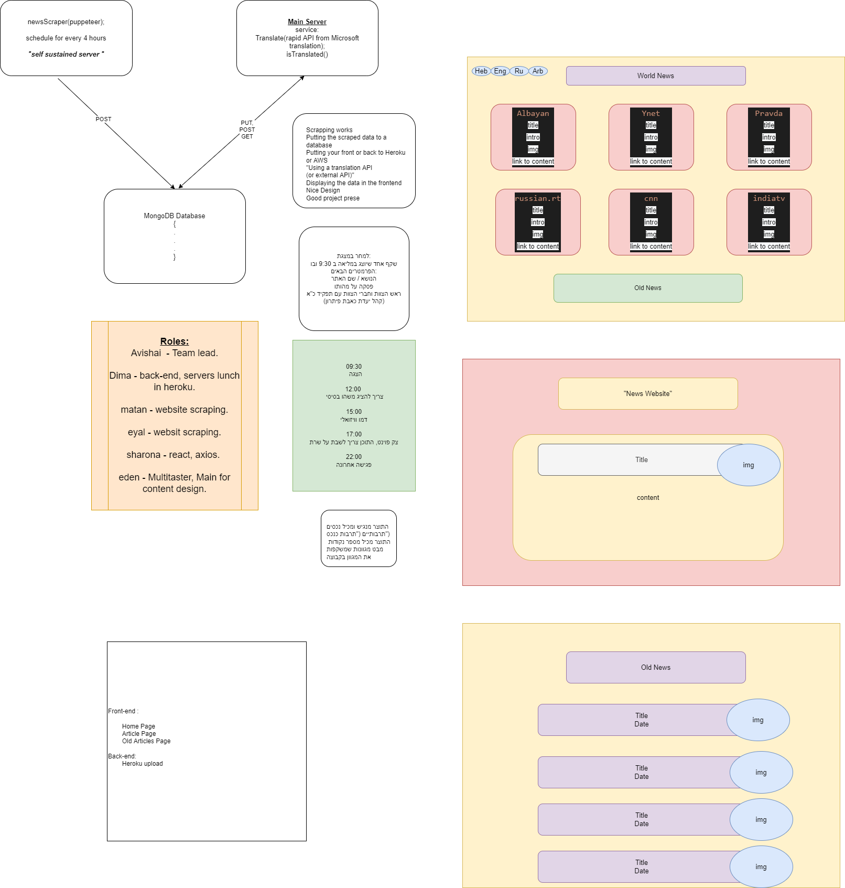
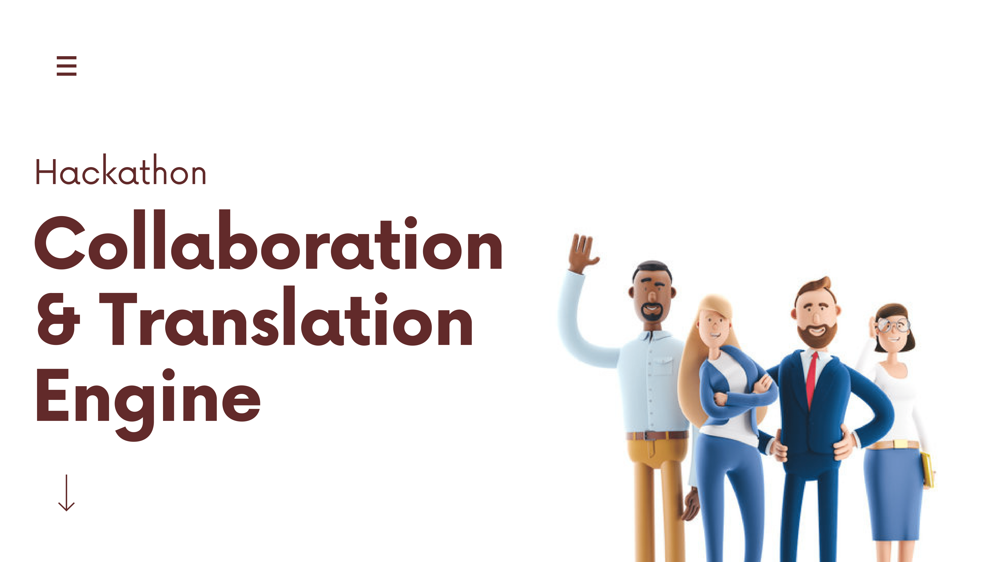
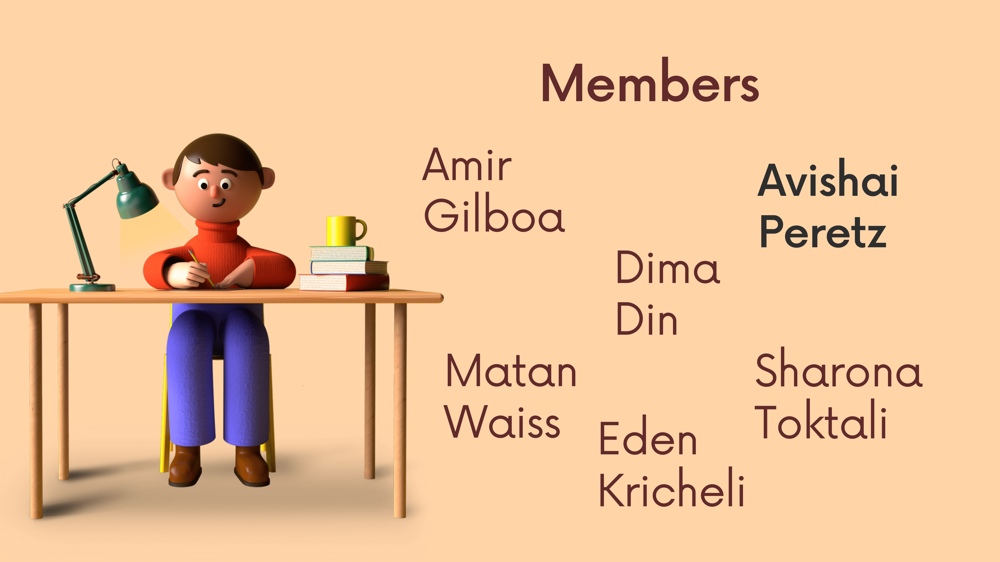
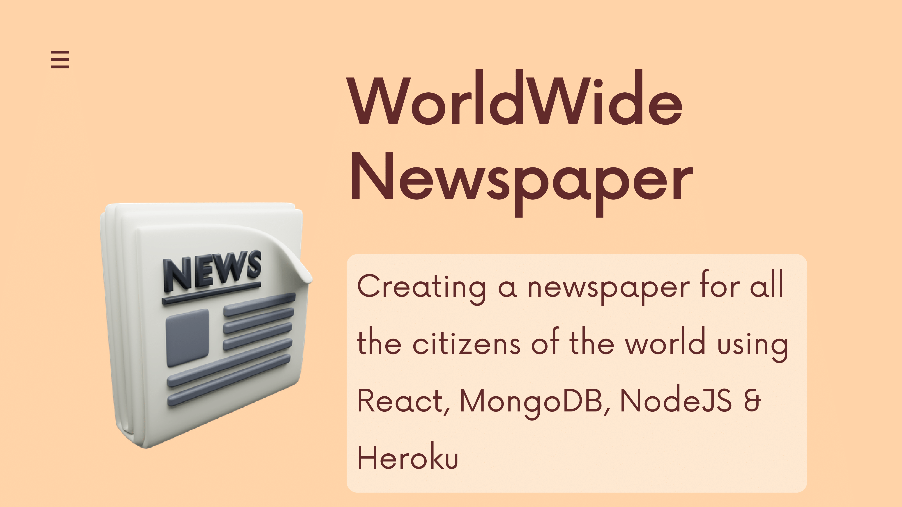

<a href="https://worldwide-news-hackathon.herokuapp.com/" target="_blank"><h1>WorldWide News</h1></a>

<h3>
 years ago, the biggest news of the day was, the visit of some new person to the village, Or new royal order. A trip between counties could take months… years.However, these days, the world is a “small spot” in an elephant's packet, where you can Jump in by a single click ….touch … call, And cross continents in a number of hours. So, it is good .. , necessary!To be up to date, and get the ‘hottest news cakes” of our “small spot ”The Israeli community is very diverse and speaks many languages We discovered some need for community and we delivered this applicationThe application display for users, a number of the latest news from the world's news Websites from different countries and languages The application allows to users read the news in different languages And all ways to be up to date, and knows what app around the worldDon't forget to take a look, before you take your next .
</h3>

<h1>About Us</h1>
<h3>
We are 6 group members who met through a programming bootcamp. Our values & identities stem from different roots of religions & cultures together with our other class mates. So, this week’s mission was to find an idea that represents & connects us all on a deeper level.
</h3>

Team Leader - Avishai

Back-End - Matan

Back&Front - Amir

Front-End - Dima

Front-End - Sarona

Front-End - Eden

<h1>Project Diagrams:</h1>

